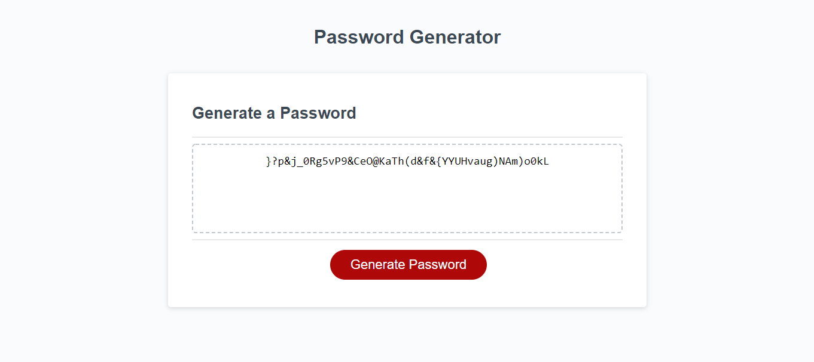

# Password Generator

## Description

This application is used to generate a random password based on slected criteria. Users are propmted to slect the length of their password and then are propmted to choose which type of characters they want included in their password. The randomly generated password then appears in the browser.

## Built With

- HTML
- CSS
- Javascript

## Website

## ScreenShot

